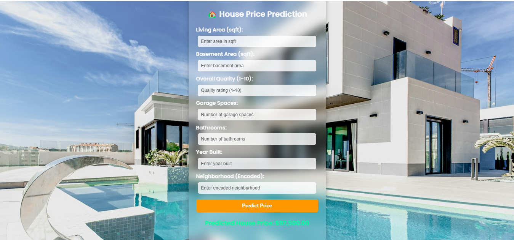

# house-price-prediction using Machine Learning


This is a **Flask-based web application** that predicts house prices based on user inputs. The model is trained using **machine learning** techniques on real estate data.

## 🚀 Features
- 🌍 **Web Interface** – Users can enter details to get price predictions.
- 🧠 **Machine Learning Model** – Uses a **DecisionTreeRegressor** for predictions.
- 📂 **Flask Backend** – Handles user input and serves predictions.
- 🎨 **Styled UI** – Enhanced with CSS and a background image.
## 🖼️ Screenshot


## 📦 Setup & Installation

### 1️⃣ Clone the Repository  
```sh
git clone https://github.com/12sandra/house-price-prediction.git
cd house-price-prediction
